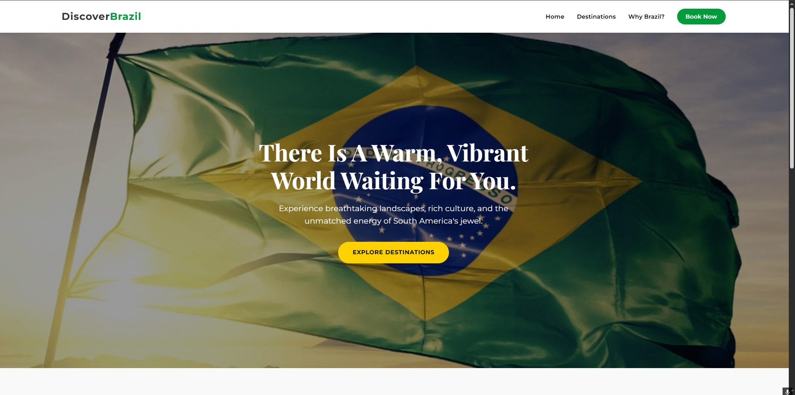
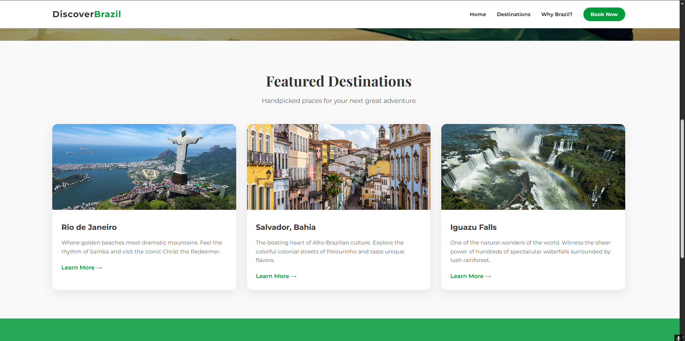
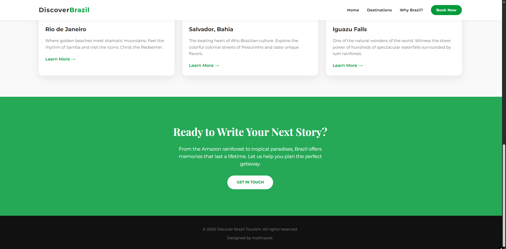

<h1 align="center"> Tourism Landing Page </h1>

Project developed through Rocketseat Landing Page challenge to WEB tecnology knowledge.  

  <a href="#-tecnologias">Technologies</a>&nbsp;&nbsp;&nbsp;|&nbsp;&nbsp;&nbsp;
  <a href="#-projeto">Project</a>&nbsp;&nbsp;&nbsp;|&nbsp;&nbsp;&nbsp;
  <a href="#-layout">Layout</a>&nbsp;&nbsp;&nbsp;

 

  
   
  
   
  

## 🚀 Technologies

This project was developed using the following technologies:

- HTML
- CSS
- Figma
- Git e Github

## 💻 Project

This project was developed through Rocketseat Landing Page challenge.

- [See the challenge here](https://app.rocketseat.com.br/projects/desafio-pratico-local-turistico?module_slug=desafio-pratico-local-turistico&origin=%2Fjourney%2Ffull-stack%2Fcontents)

- [Rocketseat](https://www.rocketseat.com.br/)

## :memo: License

Made with ♥ by mathrazak :wave: